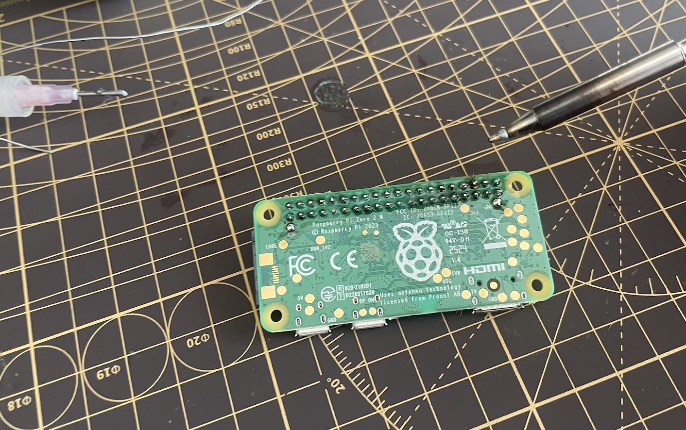
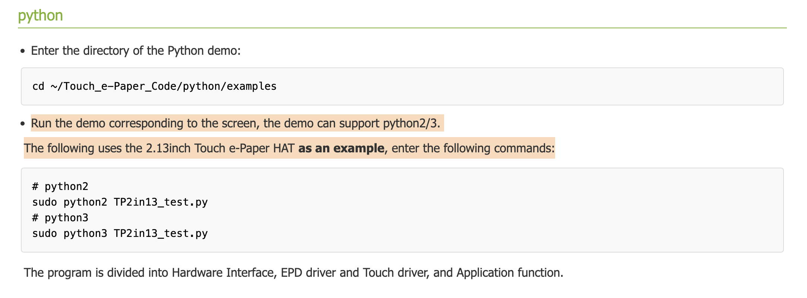
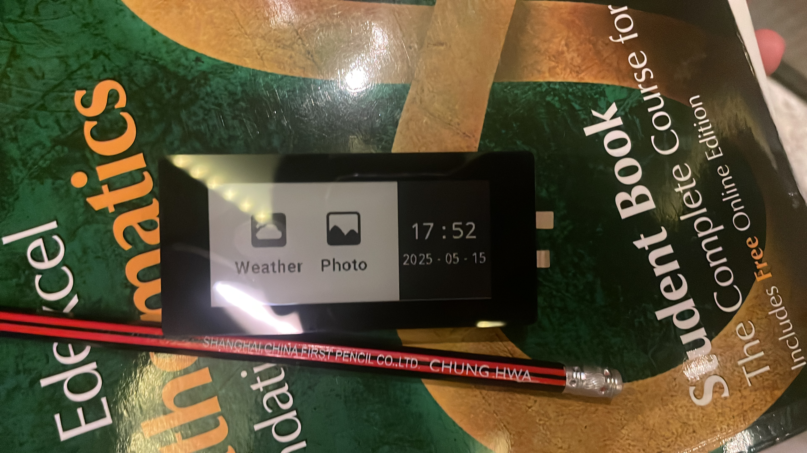

# May 15th: Time Spent: 3hrs

I'm using a touch E-Paper Screen from waveshare. I'm choosing it specifically because of it's ease of use 
and good documentation from waveshare. 

Well, the parts arrived today, very exciting. Originally, this wasn't a hackclub project, it just so happpens that highway launched so coincidentally. 

Today, I soldered the 40pin GPIO headers to my Pi Zero 2 W, and connected the E-Paper Hat onto it. 



(please ignore that "fume extractor" that is really just a neck fan at full blast and my lack of soldering skills.)

The Waveshare wiki for this screen is fairly well doccumented, and so I had minimal trouble running its demo. 

Essentially, it was more or less like:

```bash
# Enable I2C and SPI
sudo apt-get install python3-pip
sudo apt-get install python3-pil
sudo apt-get install python3-numpy
```

then download the waveshare demo:
```bash
cd ~
wget https://files.waveshare.com/upload/4/4e/Touch_e-Paper_Code.zip
unzip Touch_e-Paper_Code.zip -d Touch_e-Paper_Code
```

However when I was running the demo, it kept on giving out epaper busy release.

Well, after contacting waveshare support and getting instantly humbled, I realised I litterally cannot read english.


What I was running was actually the demo code for the 2.19 inch version of this display, haha. 



Well, after all that, finnaly got the demo to work. (yay!)



Thank you for reading my horrible journal so far. I'll get started on the main program tommorow

Time Spent: 3hrs.
Total Time Spent: 3hrs.


After that, made a quick python file that shows the time, to test the partial refresh ability of the screen.
(it works!)

<video width="100%" controls>
  <source src="img/partial.mp4" type="video/mp4">
</video>

Thank you for reading my horrible journal so far. I'll get started on the main program tommorow

***Time Spent: 3hrs.***
**Total Time Spent: 3hrs.**


# May 16th: Time Spent: 3hrs

