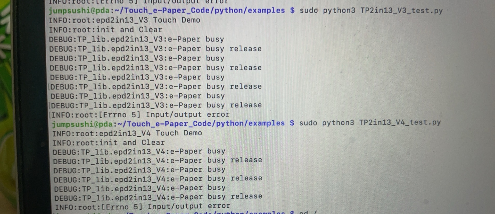

# May 15th: Time Spent: 3hrs

I'm using a touch E-Paper Screen from waveshare. I'm choosing it specifically because of it's ease of use 
and good documentation from waveshare. 

I should clarify that this screen is from a friend of mine, and he happened to use it for another project before. 

Today, I soldered the 40pin GPIO headers to my Pi Zero 2 W, and connected the E-Paper Hat onto it. 


(please ignore that "fume extractor" that is really just a neck fan at full blast and my lack of soldering skills.)

The Waveshare wiki for this screen is fairly well doccumented, and so I had minimal trouble running its demo. 

Essentially, it was more or less like:

```bash
# Enable I2C and SPI
sudo apt-get install python3-pip
sudo apt-get install python3-pil
sudo apt-get install python3-numpy
```

Then download the waveshare demo:

```bash
cd ~
wget https://files.waveshare.com/upload/4/4e/Touch_e-Paper_Code.zip
unzip Touch_e-Paper_Code.zip -d Touch_e-Paper_Code
```

**However when I was running the demo, it kept on giving out epaper busy release.

Well, after contacting waveshare support and getting instantly humbled, I realised I litterally cannot read english.



What I was running was actually the demo code for the 2.19 inch version of this display, haha. 


Well, after all that, finnaly got the demo to work. (yay!)

**


**After that, made a quick python file that shows the time, to test the partial refresh ability of the screen.
(it works!)**

<video width="100%" controls>
  <source src="img/partial.mp4" type="video/mp4">
</video>

The video is at img/partial.mp4

Thank you for reading my horrible journal so far. I'll get started on the main program tommorow.

***Time Spent: 3hrs.***

---

# May 16th: Time Spent: 4hrs

Tried my best to implement a network screen and stats screen, built ontop of the exsisting time partial refresh test. Used api key from openweathermap, and investigated how the touch works.

CPU temp is measured with vcgencmd 
and RAM is measure with free

At first, there was no touch debounce and it was constantly polling the cpu instead of checking the INT pins for touch, which lead to multiple touches being registered unintentionally. 

By refrenching the original waveshare demo code, i was sucessfully able to implement debounce. (0.3s)

Also, to prevent the refreshes from slowing down, touch_detection_thread() is started in a seprate thread, to prevent slow downs. 

As this was my first time working with e-paper/e-ink displays, I was unaware that you need to do a full refresh after a set amount of paritals, as to avoid screen burn in. Im not too sure what to set it to, but I think 5 partials for every full refresh should be ok 🤞

When touch is deteched, it prints the x,y coordinates in the terminal and then checks if its in the zone of the "button", which is defiend in the touch_detection_thread() 

So far, easier than I expected, actually.

Here are some poorly taken pictures:


Time dosen't match up since I forgot to take photos that day :/

***Time Spent: 4hrs.***
**Total Time Spent: 7hrs.**

---

# May 17+18th: Time Spent: 7hrs

Implemented the timetable, which parses the ics calender files from my schools timetable api. My school uses a two week rotation system, week 1 and week 2. 

All of monday's classes are 50mins instead of 1hr, making school end at 2:05.

ICSparser mainly does all the heavy lifting, it downloads, parses and then stores into cache so you can still acsess it without the interweb. If you're curious about the debug_timetable_data function, its just a helper that prints some debugging info about the current day's classses, and uses a refrence date (may 19th), to calculate which week is which. The function exsisits simply to act as a sanity check, as at first sometimes data is wrong and inverted.

Also started the bulletin scraping from the school website, which funnily enough dosen't work when you have a valid session cookie, but only when you sign out. It just redirects you back to the homepage of the school portal 🤷🏻

When school ends (3:20) or (2:05) on mondays, it will refresh and show tommorows timetable. Nice quality of life addition. 

Photo to be added

***Time Spent: 7hrs.***
**Total Time Spent: 14hrs.**

---

# May 19th: Time Spent: 8hrs

Made a barely working bulletin ui, held together by hopes and dreams. (i cannot be more serious)

The script works by first grabbing the raw html from the school's bulletin page, but there's this funny quirk where it only works if you're not logged in, otherwise it just redirects you to the homepage. So the code has to specifically clear any session cookies before making the request.

Once it gets the bulletin data, it processes it:

- Filtering for announcements relevant to year 9 students (either specifically targeted to year 9 or general announcements)
- Filtering out donation requests and feedback forms (i really hate those low effort posts from people)
- Generating headlines using either an ai.hackclub.com or a fallback method that just takes the first sentence
- Caching everything both in memory and in a json file

the whole thing runs in a background thread that fetches new bulletins at set times, (8am and 4pm). this way the main program can just grab the latest items from a queue whenever it needs to update the display.

the rendering code: it does proper word wrapping, handles long urls by breaking them into chunks, and adjusts the font size based on content length. it even dynamically decides whether to show a "return to list" button based on whether you're on the last page of content or not!!!! (wow, totally not sarcasm)

all of this gets drawn onto the eink display with a nice header showing the time and date. it's a pretty solid implementation for an eink display where you need to be careful about refreshes and making text readable, at least in my opinion

add photo here in future

***Time Spent: 8hrs.***
**Total Time Spent: 22hrs.**

# May 20th: Time Spent: 2hrs

spent forever trying to debug the icsparser showing week2 data for week1 classes, in the end it was due to the refrence date calculation being wrong, and that was "easily" fixed (aka slamming my head into a table for 2hrs)

now the timetable should show the correct class in accordance with the week rotation! (yay!)

can't believe I spent a whole day of my life doing this


***Time Spent: 2hrs.***
**Total Time Spent: 24hrs.**

# May 21st:

